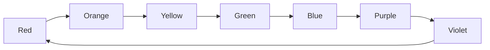
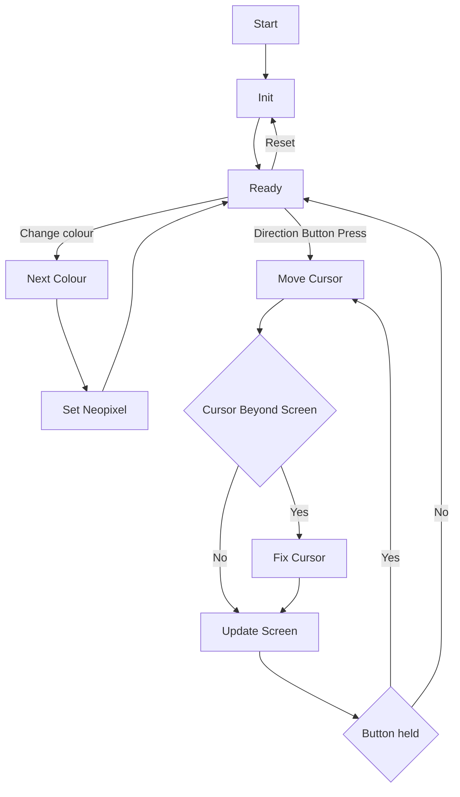

# Coloured Etch-a-sketch

# Overview

The project is to make a etch-a-sketch with a muliti-coloured display.  I will be using the rp2040. Since the board that I am using features a neopixel, I can use that to display the current colour to be drawn to the screen.

## Inputs
* Up
* Down
* Left
* Right
* Change colour
* Reset (Might be an IMU to shake to clear the screen)

## Outputs
* Display
* Neopixel

## Important Variables
* position_x
* position_y
* max_x
* max_y
* colour

### The colour to draw will change on each button press

### States

